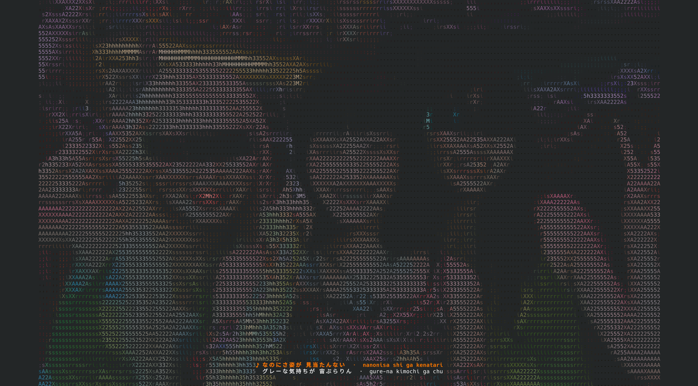
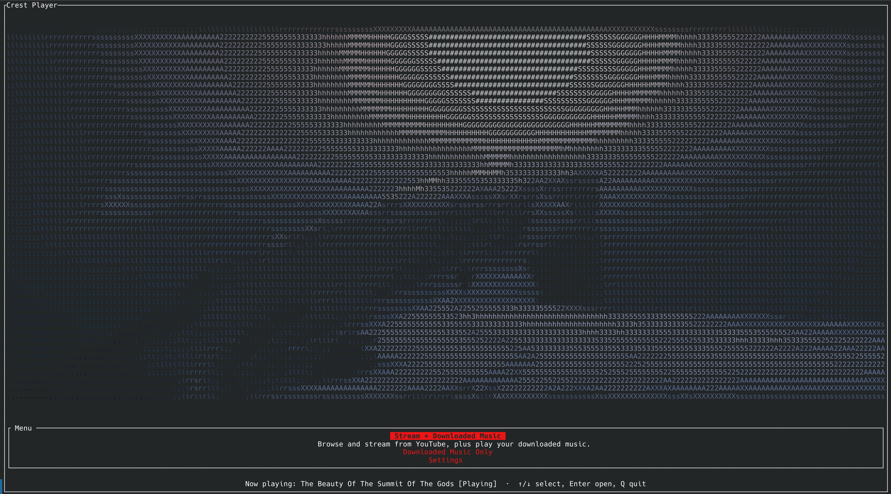

# Crest Player

A lightweight terminal music player written in Rust. Crest Player searches YouTube,
plays local or downloaded music, displays synchronized lyrics, and turns into an
ASCII music-video display when left idle.

## Features

- Search and progressively stream YouTube audio without blocking the interface.
- Play, download, queue, and delete tracks from a local music library.
- Share one queue across streaming and downloaded-only modes.
- Show synchronized lyrics, YouTube-caption fallback, and optional Japanese romaji.
- Overlay current and upcoming lyrics during Ambient and Cinema playback.
- Render music videos as fast ASCII, detailed dithered ASCII, or true-color pixels.
- Choose 15, 24, 30, or 60 FPS, or adaptive **AUTO** mode.
- Predecode ten seconds of video, retain ten seconds of history, and drop late frames.
- Use optional hardware decoding with automatic software fallback.
- Save compact `.crestvid` caches with embedded lyrics for downloaded tracks.
- Capture a video frame as the Home wallpaper.
- Optionally prefetch YouTube Mix recommendations when the queue is empty.
- Persist settings in the platform configuration directory; on Linux this is
  normally `~/.config/crest-player/settings.json`.

## How It Works

### Non-blocking downloads and progressive streams

Search, stream resolution, permanent downloads, lyrics, and video-cache builds
run outside the input loop. Active jobs appear in a temporary **Download Queue**
panel, which closes when the final job finishes. Streamed tracks resolve
YouTube's best audio URL and play progressively through `ffplay`; they are not
downloaded as complete temporary MP3s. Permanent `Ctrl+L` downloads still save
an MP3 and build its reusable video cache.

### Compact `.crestvid` caches

New `.crestvid` files are Matroska containers tuned for terminal playback:

- H.264 video at 700 kbps, capped at 900 kbps
- YUV420 color and Lanczos scaling at terminal resolution
- ten-second keyframe boundaries for bounded seeking
- the x264 `slow` preset for better quality at the target size
- no audio duplication; the library MP3 remains separate
- embedded synchronized or plain lyrics when available

A four-minute cache typically targets roughly 20–27 MB, although simple videos
may be smaller. Crest Player also reads older V1/V2 indexed zstd caches. Cache
deletion is limited to songs and sidecar videos recorded in Crest Player's
library index.

### Smooth, clock-driven video

Video decoding starts when audio playback begins, before Ambient appears. A
background FFmpeg worker decodes up to ten seconds ahead while Crest Player keeps
up to ten seconds of recent frames for backward seeking. Both sides are bounded
by 64 MiB memory limits. Presentation follows the audio clock: obsolete frames
are dropped instead of rendered in a catch-up burst, and future frames wait for
their timestamp. Synchronized terminal updates reduce tearing.

Fixed 15, 24, 30, and 60 FPS modes are available. **AUTO** starts at 30 FPS and
adapts to measured terminal-render cost. FFmpeg can use available CPU threads;
optional hardware decoding retries in software if acceleration fails.

### Lyrics, recommendations, and presentation

Lyrics come from LRCLIB with manual or automatic YouTube captions as fallback.
Japanese text can be romanized locally, and downloaded caches carry their lyric
subtitle stream plus a marker indicating whether timing is genuine. Playback
checks embedded lyrics before using the network.

Autoplay resolves a YouTube Mix recommendation in the background and never
jumps ahead of manually queued tracks. Home keeps audio and queue progression
active without opening the video overlay. A visible video frame can also be
captured into the persisted Home wallpaper format without storing another full
video.

## ASCII Music-Video Playback



Video frames are sampled at terminal resolution and mapped to a colored ASCII
ramp. **ASCII Detailed** adds dithering and texture; **ASCII Fast** favors speed.
Color Precision balances terminal bandwidth against fidelity. Synchronized
lyrics remain overlaid.

Adjust terminal font size to trade speed for detail: smaller text increases video
resolution; larger text renders faster. Common shortcuts are `Ctrl+Shift++` and
`Ctrl+Shift+-`, though terminal bindings vary.

Press `` ` `` during video playback to capture the frame as the Home wallpaper.
Use **Reset Home Wallpaper** in Settings to restore the default mascot.



## Video Playback Disclaimer

Terminal dimensions, render mode, color precision, FPS, and emulator performance
all affect smoothness. Audio stays synchronized when late video frames are
dropped. A GPU-accelerated terminal such as [Kitty](https://sw.kovidgoyal.net/kitty/)
is recommended.

## Active Video CPU Benchmark

Measured on an **Intel Core Ultra 9 386H** with 16 logical CPUs using a release
build, 80×24 terminal, ASCII Detailed, High color precision, 60 FPS, hardware
acceleration, and autoplay. Results were rerun on August 10, 2026, average 30
samples taken 750 ms apart, and include all media child processes. The video
overlay remained active throughout both runs, including decode-ahead,
audio-clock scheduling, ASCII conversion, synchronized lyrics, and terminal
rendering. Here, 100% equals one fully occupied logical CPU.

| Playback mode | Crest Player | `ffplay` | `ffmpeg` | `yt-dlp` | Combined average | Combined peak | Average total capacity | Peak total capacity |
| --- | ---: | ---: | ---: | ---: | ---: | ---: | ---: | ---: |
| Downloaded MP3 + 8.6 MB `.crestvid` | 1.18% | 1.01% | 22.25% | 0.00% | **24.44%** | 28.92% | **1.53%** | 1.81% |
| Streamed song + live video | 1.01% | 1.05% | 18.13% | 6.44% | **26.63%** | 115.72% | **1.66%** | 7.23% |

Downloaded playback used **Liza – PARALLEL feat. 7** and its 8.6 MB cache;
streaming used **Daft Punk – One More Time** with live video processing.
Downloaded video averaged **24.44% of one core** (**1.53%** of the full CPU),
while streamed video averaged **26.63% of one core** (**1.66%** overall). The
streaming peak was a brief URL-resolution and prebuffering burst, not sustained
load. GPU usage was not measured; results vary by terminal, network, settings,
and FFmpeg build.

## Controls

| Input | Action |
| --- | --- |
| Arrow keys | Navigate results and library entries |
| `Enter` | Search, play, queue, or activate a Home option |
| `Backspace` | Delete the previous character while entering a search |
| `Ctrl+L` | Download/save the selected track |
| `Delete` | Permanently remove the selected song from the library |
| `Ctrl+P` | Pause or resume |
| `Ctrl+N` | Skip to the next queued track |
| `Alt++` / `Alt+-` | Seek forward/backward five seconds |
| `V` | Toggle the library panel |
| `` ` `` | Capture the visible music-video frame as the Home wallpaper |
| `Esc` | Clear results and return to search |
| `Ctrl+Left Arrow` | Return to Home |
| `Ctrl+Q` | Quit |

### Downloaded-library commands

Enter these in **Downloaded Music Only** mode:

| Command | Action |
| --- | --- |
| `:shuffle queue` | Randomize the current playback queue |
| `:shuffle all` | Add every downloaded library song to the queue, then randomize it |
| `:clear` | Empty the playback queue without stopping the current song |

`Esc` clears the command bar. The first input wakes the screensaver and is
consumed; playback shortcuts continue to work in Ambient and Cinema.

## Getting Started

Install Rust, Cargo, `yt-dlp`, and FFmpeg (`ffplay` must be included).

Arch Linux:

```sh
sudo pacman -S yt-dlp ffmpeg
```

Ubuntu/Debian:

```sh
sudo apt update
sudo apt install yt-dlp ffmpeg
```

Build and run:

```sh
cargo build --release
./target/release/crest-player
```

Optional system-wide install:

```sh
sudo cp target/release/crest-player /usr/local/bin/crest-player
```

### Command-line options

Display the available commands without opening the interface:

```sh
crest-player --help
```

| Option | Action |
| --- | --- |
| `-h`, `--help` | Display command-line help and exit |
| `--install-desktop` | Add or refresh the per-user Linux application launcher and icon |
| `--remove` | Interactively remove Crest Player and its data |
| `--storage` | Display application, downloaded-music, and video-cache storage usage |

Run `crest-player` without an option to open the player normally.

### Linux application launcher

The Arch package installs a **Crest Player** desktop entry that opens the app in
a terminal. When a systemd user session is available, the launcher places Crest
Player and its `ffplay`, `ffmpeg`, and `yt-dlp` helpers in one named scope. System
monitors that display cgroups can therefore show the process tree as one Crest
Player application. On other Linux sessions, the launcher falls back to running
the player normally.

For a manual, system-wide installation, copy the launcher and desktop entry too:

```sh
sudo cp packaging/linux/crest-player-launch /usr/local/bin/
sudo cp packaging/linux/io.github.ArvalCode.CrestPlayer.desktop /usr/share/applications/
sudo install -Dm0644 packaging/linux/icons/io.github.ArvalCode.CrestPlayer.svg \
  /usr/share/icons/hicolor/scalable/apps/io.github.ArvalCode.CrestPlayer.svg
```

## Windows (PowerShell)

Install Microsoft C++ Build Tools with **Desktop development with C++**, then
install Rust, Git, `yt-dlp`, and FFmpeg. With WinGet:

```powershell
winget install --id Rustlang.Rustup --exact
winget install --id Git.Git --exact
winget install yt-dlp
winget install --id Gyan.FFmpeg --exact
```

Restart PowerShell so the tools are on `PATH`, then build:

```powershell
git clone https://github.com/ArvalCode/crest-player.git
Set-Location crest-player
cargo build --release
.\target\release\crest-player.exe
```

Windows Terminal is recommended for ANSI color and Unicode rendering.

### Windows data locations

- Settings: `%APPDATA%\crest-player\settings.json`
- Captured Home wallpaper: `%APPDATA%\crest-player\home-wallpaper.rgb`
- Downloaded library and its index: the current user's Music folder

### Current Windows limitation

Native Windows supports playback, search, downloads, video, seeking, and skipping.
`Ctrl+P` pause/resume relies on Unix signals and does not currently suspend
`ffplay` natively; WSL uses the Linux behavior.

## Uninstalling

For a complete interactive uninstall, run:

```sh
crest-player --remove
```

The command offers three choices: remove only the application while keeping
music and settings, remove only indexed music/video while keeping the application
and settings, or remove everything. It explains the selected scope and requires
typing `REMOVE` before changing anything. Package installations are removed
through `pacman`; on Linux, choices that remove application files require
`sudo`, while personal media and configuration cleanup runs as the current user.
Application removal also deletes the per-user launcher, desktop entry, and icon
created by `--install-desktop`.
After successful removal, it reports the total amount of Crest Player storage
removed in MiB.
The command refuses to uninstall when run from a development checkout or an
unrecognized location, preventing accidental source-tree deletion.

The platform-specific manual steps below are provided for auditing or recovery
if the executable no longer runs.

The following steps remove the program and every file owned by Crest Player.
Uninstalling only the executable intentionally leaves settings and downloaded
music behind.

Before uninstalling, quit Crest Player. Its systemd scope is transient and
disappears when the player and its media helpers exit; Crest Player does not
install a system service or background daemon.

If the program still runs, remove downloaded media safely from inside it first:
open **Settings**, choose **Delete All Known Songs/Videos**, and confirm. This
uses the library index to delete only MP3 and `.crestvid` files known to Crest
Player. Quit the player afterward. If you want to keep downloaded music, skip
this step.

### Arch Linux package

Remove the AUR package. The `-s` option also removes its dependencies only when
no other installed package needs them, while `-n` removes package backup files:

```sh
sudo pacman -Rns crest-player-git
```

This removes `/usr/bin/crest-player`, `/usr/bin/crest-player-launch`, the desktop
entry, icon, license, and packaged documentation. Remove per-user settings and
the captured Home wallpaper with:

```sh
rm -rf ~/.config/crest-player
```

If `XDG_CONFIG_HOME` points somewhere other than `~/.config`, remove the
`crest-player` directory there instead. Remove the library index from the Music
directory selected by your desktop environment (normally `~/Music`):

```sh
rm -f ~/Music/ytmusic_library.csv
```

If in-app deletion was skipped but you want complete data removal, inspect that
Music directory and delete Crest Player's `*_ytmusic.mp3` files and their
matching `*_ytmusic.crestvid` files. An interrupted download may also leave a
matching `.part` or `*_ytmusic.video.cache` file. Check filenames before removal
instead of applying a broad wildcard to a Music directory containing unrelated
files.

An AUR helper may retain a build checkout after the package is removed. These
common cache directories are not installed program files, but can be deleted if
present:

```sh
rm -rf ~/.cache/yay/crest-player-git
rm -rf ~/.cache/paru/clone/crest-player-git
```

### Manual Linux installation

If you followed the manual commands in this README, remove the installed player,
launcher, desktop entry, and icon:

```sh
sudo rm /usr/local/bin/crest-player
sudo rm /usr/local/bin/crest-player-launch
sudo rm /usr/share/applications/io.github.ArvalCode.CrestPlayer.desktop
sudo rm /usr/share/icons/hicolor/scalable/apps/io.github.ArvalCode.CrestPlayer.svg
```

Older installations may have only `/usr/local/bin/crest-player`; a "No such
file" message for a newer launcher or icon is harmless. Remove the configuration
directory, library index, optional media, and any interrupted-download remnants
as described in the Arch section above. Delete the cloned `crest-player`
repository from the exact location where you cloned it; its `target/` directory
contains all project-local Rust build output.

Desktop environments normally notice removed launchers automatically. If a
stale Crest Player entry or icon remains after logging out and back in, refresh
the standard caches when those utilities are installed:

```sh
update-desktop-database ~/.local/share/applications 2>/dev/null || true
gtk-update-icon-cache ~/.local/share/icons/hicolor 2>/dev/null || true
```

The package does not install either file under `~/.local`; these commands only
refresh the user's cached application menu and icons.

### Optional dependency removal on Linux

The Arch `pacman -Rns` command above already removes dependencies that became
unused. For a manual installation, FFmpeg and `yt-dlp` are runtime dependencies;
Rust and Git are build tools. Remove them through the same package manager used
to install them only if no other application or project needs them. System
libraries such as glibc, OpenSSL, zlib, zstd, and Brotli are shared components
and should not be removed manually.

Do not remove shared tools such as FFmpeg, `yt-dlp`, Rust, or Git unless you know
that no other program or project uses them.

### Windows

First use **Settings > Delete All Known Songs/Videos** if you do not want to keep
downloaded songs, then quit the player. Delete the cloned `crest-player` folder,
including its `target` build directory, and delete any copy of
`crest-player.exe` that you manually placed elsewhere. Remove settings and the
captured Home wallpaper in PowerShell with:

```powershell
Remove-Item -Recurse -Force "$env:APPDATA\crest-player" -ErrorAction SilentlyContinue
```

Lastly, remove `ytmusic_library.csv` from the current user's actual Music folder.
If in-app deletion was skipped, remove Crest Player's `*_ytmusic.mp3` and
matching `*_ytmusic.crestvid` files there, plus any matching `.part` or
`*_ytmusic.video.cache` remnants from interrupted work. Keep those media files
if you want to retain the downloaded library. Crest Player does not create
registry entries, scheduled tasks, Start Menu shortcuts, or a Windows service.

FFmpeg, `yt-dlp`, Rust, Git, and Microsoft C++ Build Tools are separate shared
installations. They are not part of Crest Player and should be uninstalled only
if you installed them solely for this project and no longer need them.

After completing the applicable steps, no Crest Player executable, launcher,
icon, service, settings, wallpaper, library index, downloaded media, source
checkout, or project-local build output remains on the computer.

## License
MIT
